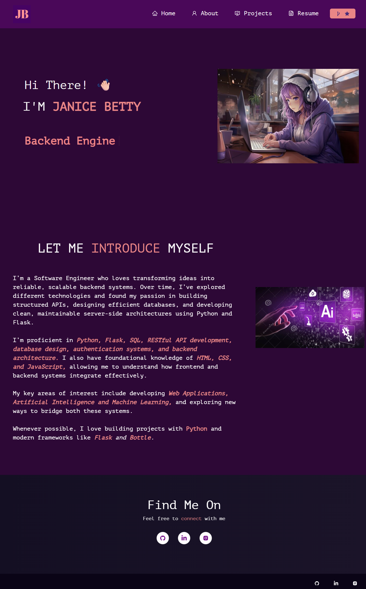
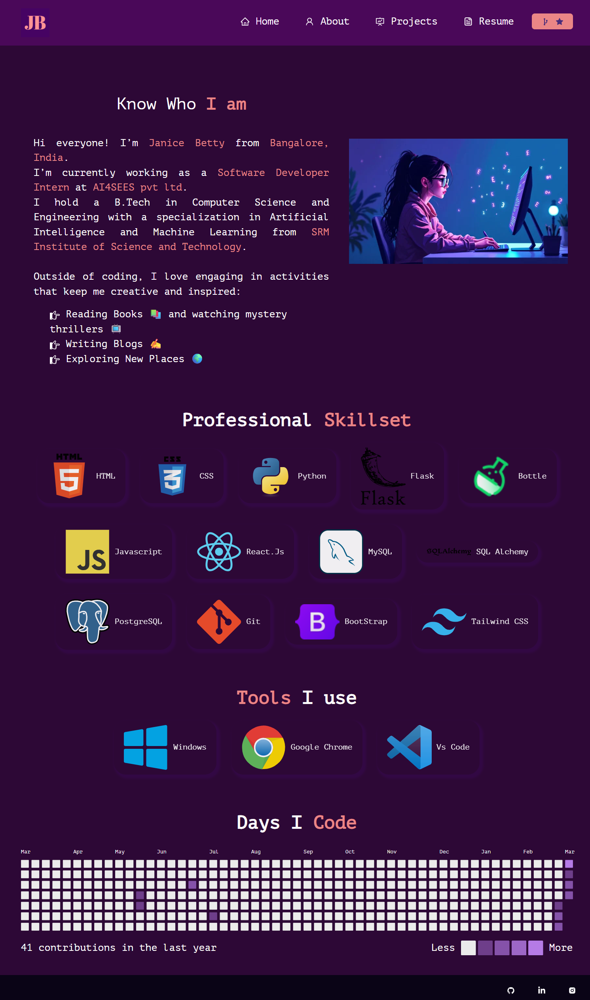
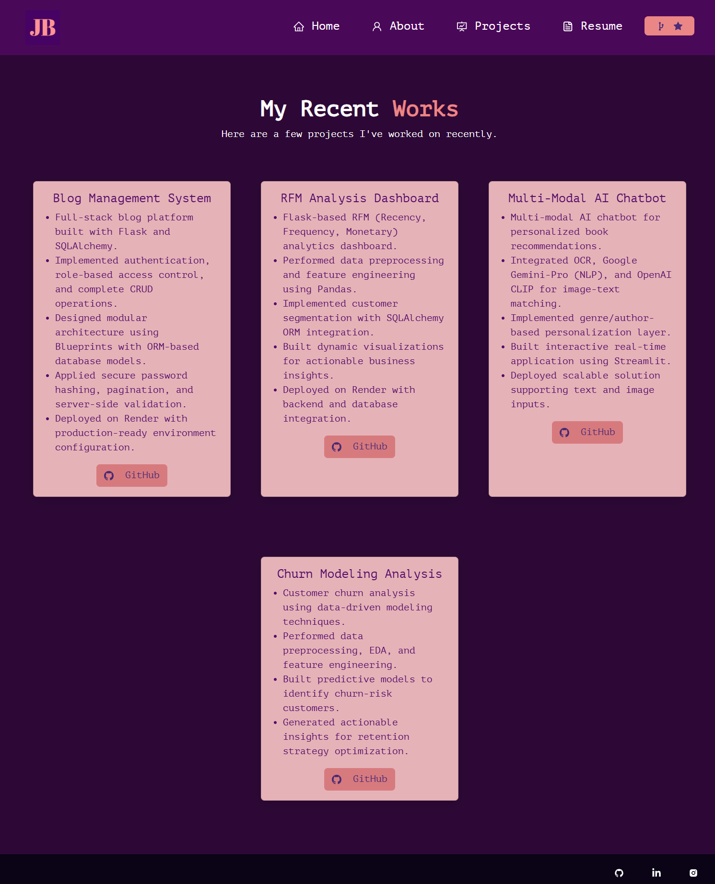
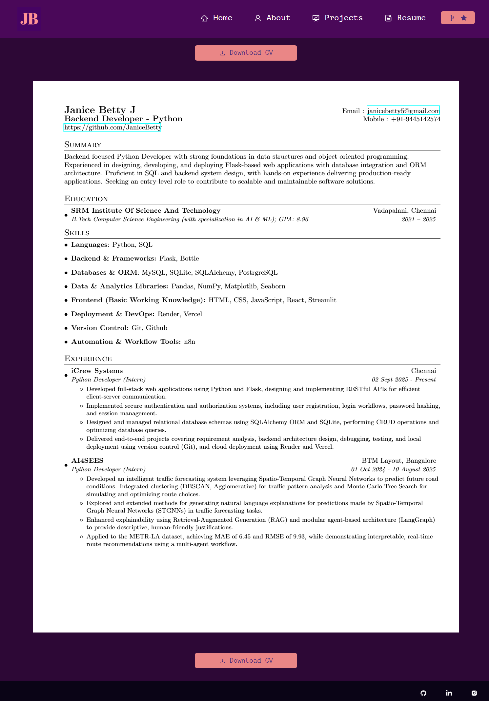

# 🌐 Personal Portfolio Website

A responsive personal portfolio website built using **React, JavaScript, HTML, and CSS** to showcase projects, skills, and contact information.

This project highlights frontend development skills, component-based architecture, and modern UI design principles.

---

## 🌐 Live Demo

🔗 [View Website](https://personal-portfolio-iota-gilt-63.vercel.app/)

---

## 📸 Preview

### 🏠 Home

<p align="center">
  
</p>

### 🙋 About

<p align="center">
  
</p>

### 🛠️ Skills

<p align="center">
  
</p>

### 📄 Resume

<p align="center">
  
</p>

---

## 🚀 Overview

The portfolio includes:

- Hero / Introduction section  
- About section  
- Skills showcase  
- Project cards with GitHub links  
- Resume download option  
- Contact section  
- Fully responsive design  

The website is built using reusable React components and clean styling.

---

## 🛠️ Tech Stack

- React
- JavaScript (ES6+)
- HTML5
- CSS3
- Bootstrap

---

## 📂 Project Structure

```
Personal-Portfolio/
│
├── public/
├── src/
│ ├── components/
│ ├── Assets/
│ ├── App.js
│ ├── index.js
│ └── styles.css
│
├── package.json
└── README.md
```

---

## ⚙️ Run Locally

```bash
git clone https://github.com/yourusername/Personal-Portfolio.git
cd Personal-Portfolio
npm install
npm start
```

---

## ✨ Key Features

- Component-based UI architecture
- Responsive layout across devices
- Clean project card design
- Organized folder structure
- Easy customization for future updates

---

## 📌 Attribution

This portfolio was adapted from an open-source React portfolio template created by [Original Author Name](https://github.com/soumyajit4419).

The project has been significantly customized and modified to reflect my own design preferences, content, and structure.

## Author

Janice Betty
